# 🚀 FSD

> Full-Stack Development Project for Sem 4

---

## 📌 Problem Statement

Building a robust full-stack web application to manage **Connecting students with other students who have similar interests,give them mentorship and even the opportunity to participate in competitions**.

---

## 🎯 Objective

FSD aims to provide users with an intuitive interface for ** Students,Mentors and Hosts of competitions, along with management**, backed by a scalable RESTful API and a responsive frontend.

---

## 🛠️ Tech Stack

### Frontend
- React.js
- Tailwind CSS
- Framer Motion (animations)

### Backend
- Django
- Node.js/Express


### Database
- Sqlite
- MongoDb

### Real-time & Integrations
- WebSockets
- WebRTC

---

## ✨ Key Features

- **User Authentication:** Signup, login, password resets  
- **CRUD Operations:** Create, read, update, delete resources  
- **Responsive UI:** Mobile-first design using Tailwind  
- **Real-time Updates:** Live data sync with WebSockets  
- **Role-based Access:** Admin vs. regular user permissions  
- **Search & Filters:** Advanced querying in listings  
- **UX features:** Voice control access to all pages, and increase in font size
---

## 📽️ Demo

https://drive.google.com/drive/folders/1ltRBKGFVGRhE8VNbpzjXDwGzN_Bv62Pv?usp=drive_link

---

## 📸 Screenshots

<!-- Add your actual image paths/screenshots here -->
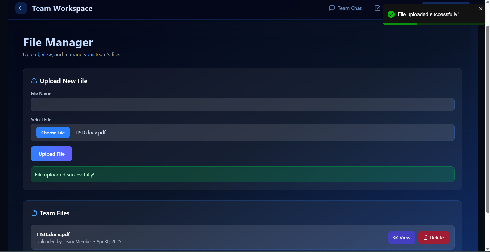
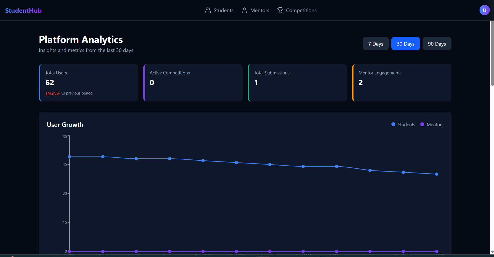
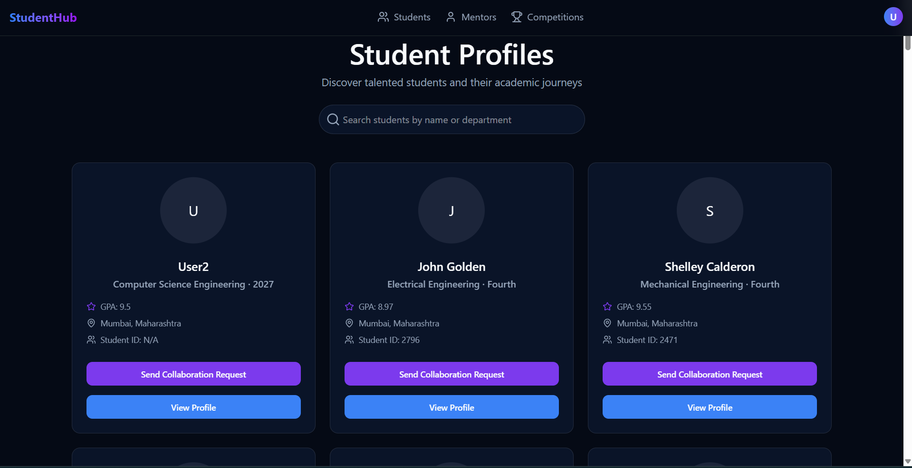
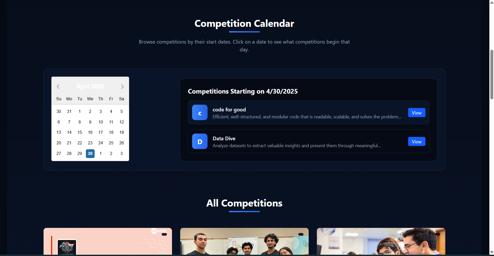
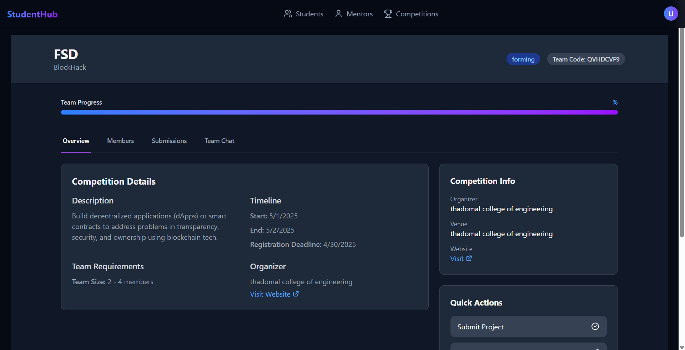
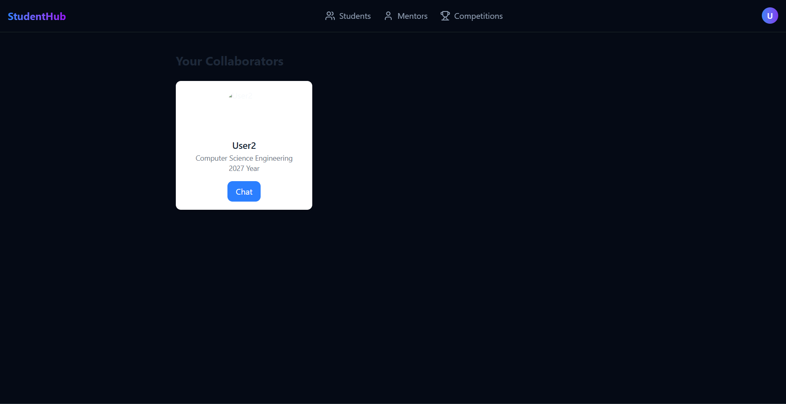
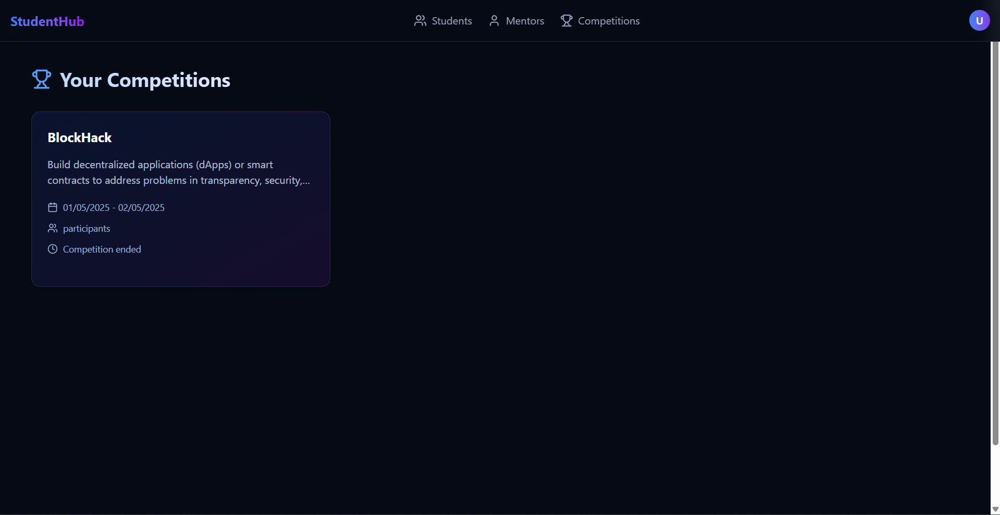
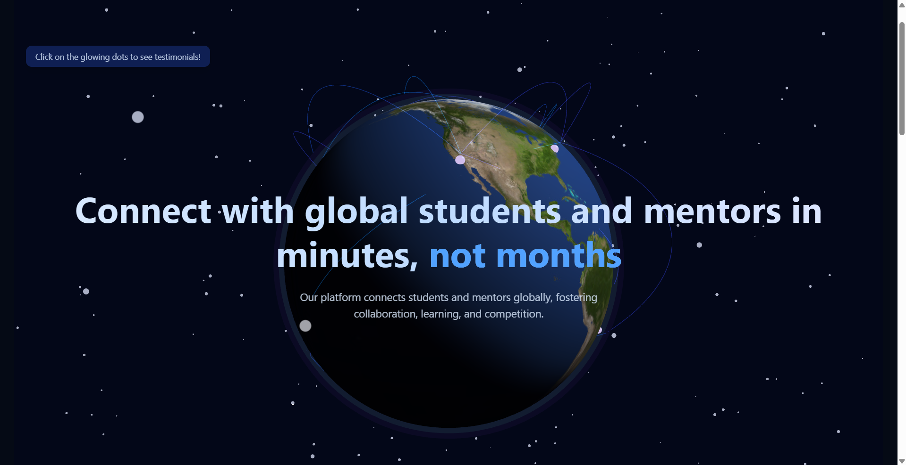
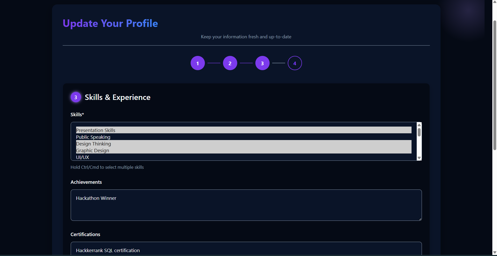
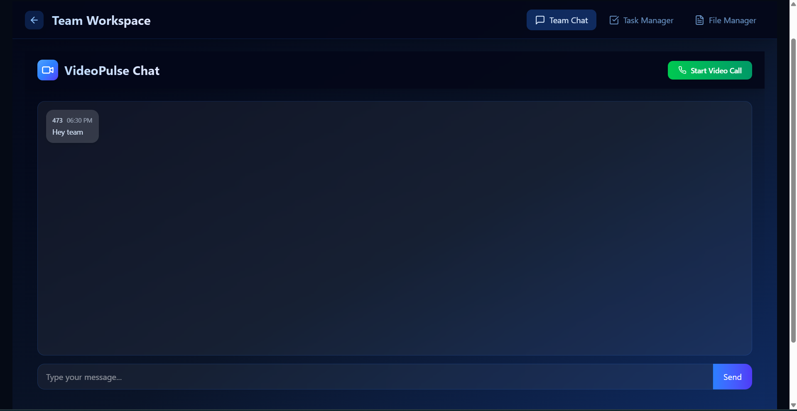
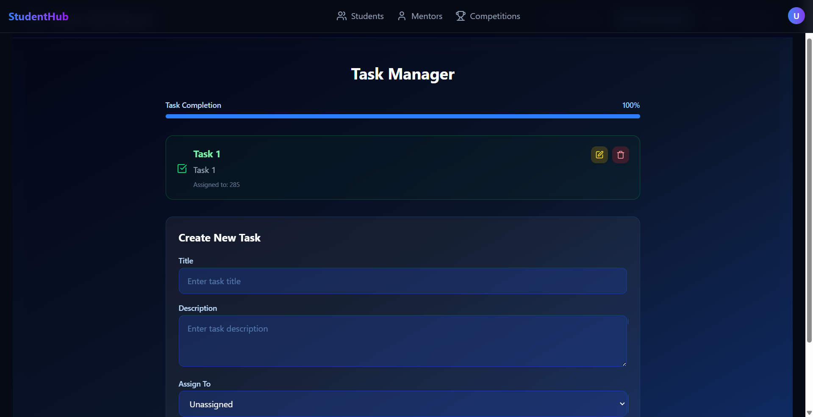

---

## 🧪 How to Run the Project

### Prerequisites
- Node.js v18+ (for React)
- Python 3.9+ & pip (for Django)
- Sqlite
- `.env` files for secrets

### Local Setup

```bash
# Clone the repo
git clone https://github.com/Hike-12/FSD.git
cd FSD

# Backend setup (Django)
cd backend
pip install -r requirements.txt
# configure your DB credentials in .env
python manage.py migrate
python manage.py runserver

# Backend setup (Node)
cd chat-server
npm install
npm run dev

# Frontend setup (React)
cd ../frontend
npm install
npm run dev
